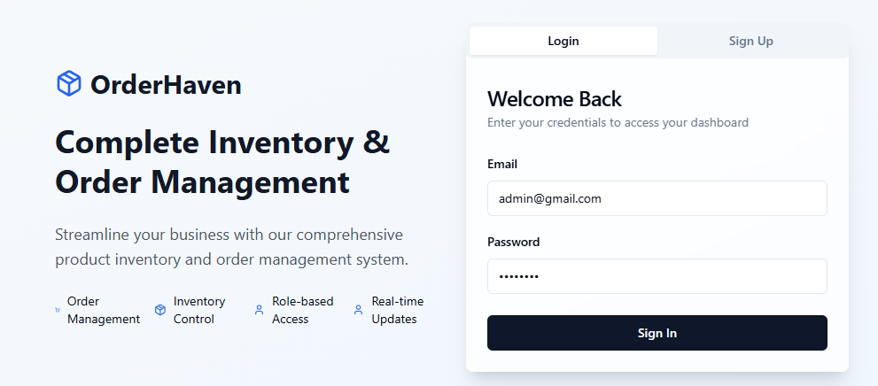
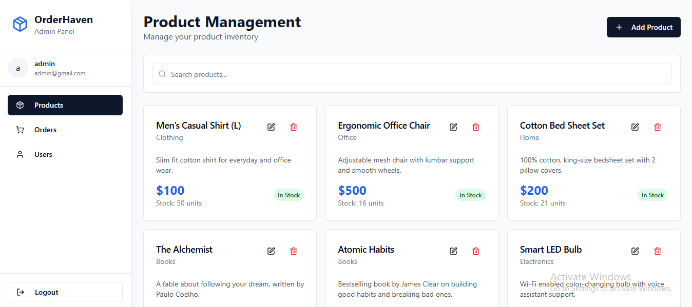
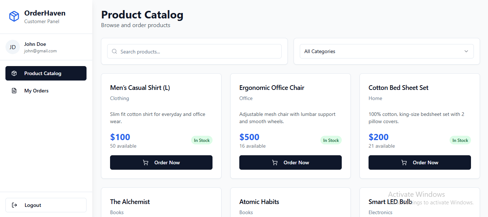

# 🧾 Inventory Management System

A full-stack Inventory Management System with role-based authentication, built using **React**, **Node.js**, **Express**, **MongoDB**, and **Tailwind CSS**. This project supports admin and customer workflows with dashboards, order management, and product catalog features.

---

---

---

## 📦 Features

### ✅ Authentication & Roles
- JWT-based login system
- Role-based routing and UI:
  - **Admin**: Manage products, orders, and users
  - **Customer**: View product catalog, place & manage orders

### 🛠️ Admin Panel
- Dashboard with statistics
- Product CRUD management
- View and manage all orders
- Manage user roles and access

### 🛒 Customer Portal
- Browse product catalog
- Place and cancel orders
- Track order history

### 📊 Reusable UI Components
- Built using Tailwind CSS
- Prebuilt UI elements like dialogs, inputs, buttons, tables, etc.
- Responsive design and mobile support

